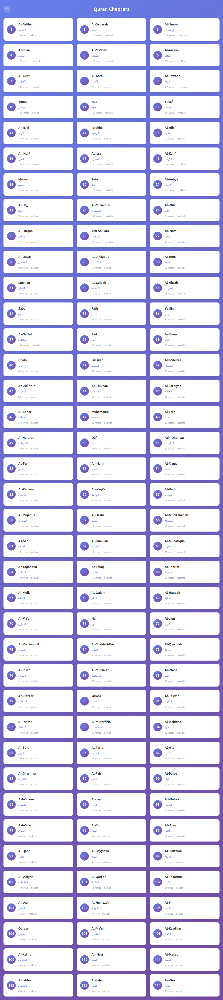
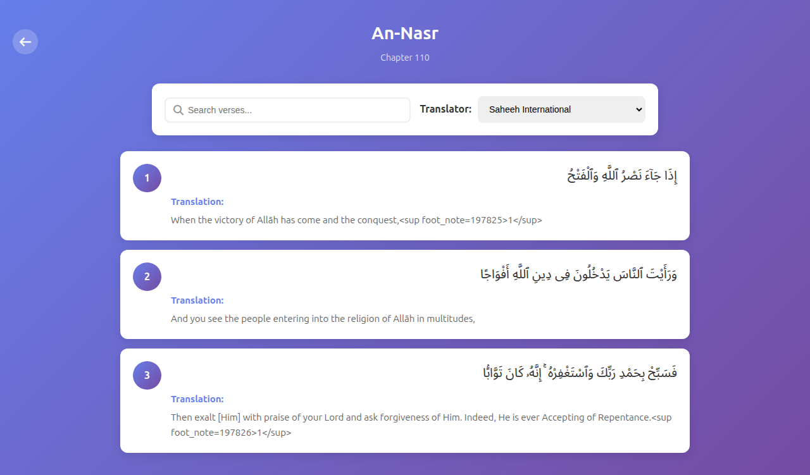

# Quran Hackathon

Angular frontend with a small Node.js backend proxy for Quran.com API requests.

## Screenshots

### Fixed Chapters Page



### Fixed Verse Page



## Project Structure

```text
Quran-Hackathon/
├── src/                  # Angular frontend
├── backend/              # Node.js backend proxy
├── proxy.conf.json       # Angular dev proxy config
└── screenshots/          # Verification screenshots
```

## How The Frontend Connects To The Backend

The frontend calls relative API paths:

```text
/content-api
/auth-api
```

During development, Angular uses `proxy.conf.json` to forward those calls to the Node backend:

```text
/content-api/* -> http://localhost:3001/api/content-api/*
/auth-api/*    -> http://localhost:3001/api/auth-api/*
```

The chapters and verses pages do not need OAuth. They use the public Quran content API through the backend proxy.

## Quran Foundation API Coverage

This project uses at least three Quran Foundation documented API areas. Current coverage is:

| API area | Endpoint used through local proxy | App usage | Code |
| --- | --- | --- | --- |
| Chapters API | `/content-api/chapters`, `/content-api/chapters/:id` | Chapter browser and chapter title lookup | `src/app/services/quran.service.ts` |
| Verses API | `/content-api/verses/by_chapter/:chapterId` | Arabic verse text, translations, word-by-word data, and verse audio segments | `src/app/services/quran.service.ts` |
| Audio API | `/content-api/chapter_recitations/:recitationId/:chapterId` | Chapter recitation player | `src/app/services/quran.service.ts` |
| Resources API | `/content-api/resources/translations` | Translator dropdown | `src/app/services/quran.service.ts` |
| Search API | `/content-api/search` | Global Quran search page | `src/app/components/global-search/` |
| OAuth2 API proxy | `/auth-api/oauth2/token` | Backend proxy support for future authenticated user APIs | `backend/server.js` |

The study library currently stores bookmarks, notes, and reading history locally in `localStorage`. Quran Foundation user-related APIs for server-side bookmarks, notes, and reading sessions require OAuth access tokens plus `x-auth-token` and `x-client-id` headers, so those are not called directly from the browser.

## Run Locally

Start the backend:

```bash
cd backend
npm run dev
```

The backend runs at:

```text
http://localhost:3001
```

Start the frontend in another terminal from the project root:

```bash
npm start
```

The frontend runs at:

```text
http://localhost:4200
```

Open:

```text
http://localhost:4200
```

## Useful URLs

```text
http://localhost:4200/chapters
http://localhost:4200/verses/110
http://localhost:4200/verses/110/1
http://localhost:4200/search
http://localhost:4200/study
http://localhost:3001/health
```

## Implemented Features

- Chapter browser for all 114 surahs.
- Chapter verse reader with Arabic text, clean translation text, audio playback, and word-by-word meanings.
- Translator selector using Quran.com translation resource IDs.
- Global Quran search at `/search`.
- Verse detail pages at `/verses/:chapterId/:verseNumber`.
- Local study library with bookmarks, notes, and reading history at `/study`.
- Empty, loading, error, invalid chapter, and 404 states.

## Verification

The fixed pages were verified with:

```bash
npm run build
```

Current known build warnings are CSS budget warnings for:

```text
src/app/landing/landing.component.css
src/app/components/verse-display/verse-display.component.css
```

The build still completes successfully.
